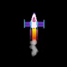

<h2 class="c-project-heading--task">Remove the outline</h2>

--- task ---

Remove the outline of the circles to make them look more realistic.

--- /task ---

The outline around the circles is called the **stroke**. Add some code to turn it off. 

--- code ---
---
language: python
line_numbers: true
line_number_start: 23
line_highlights: 26
---
# Rocket 
    rocket_position = rocket_position - 1    
    image(rocket, width/2, rocket_position, 64, 64)     
    no_stroke()
    fill(200, 200, 200, 100) 
    for i in range(20):
        ellipse(width/2 + randint(-5,5), rocket_position + randint(20,50), randint(5,10))    
--- /code ---

**Test:** Run your program and you should see the same exhaust trail but without the outlines. 

--- /task ---

