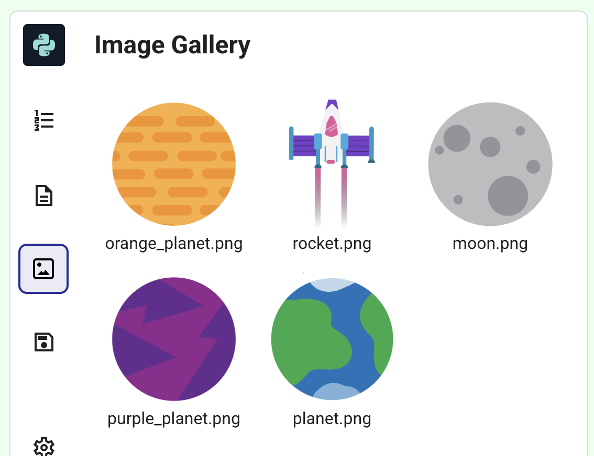

<h2 class="c-project-heading--task">A different planet?</h2>

--- task ---
Click on the image icon to the left to view the image gallery. 

If you want to change the planet image, change `planet.png` in the code to the filename of your chosen planet, for example, `orange_planet.png`. 
--- /task --- 

--- code ---
---
language: python
line_numbers: true
line_number_start: 18 
line_highlights: 23
---
def setup():
    # Set up your animation here
    size(screen_size, screen_size)
    image_mode(CENTER)
    global planet
    planet = load_image('planet.png')
--- /code ---

