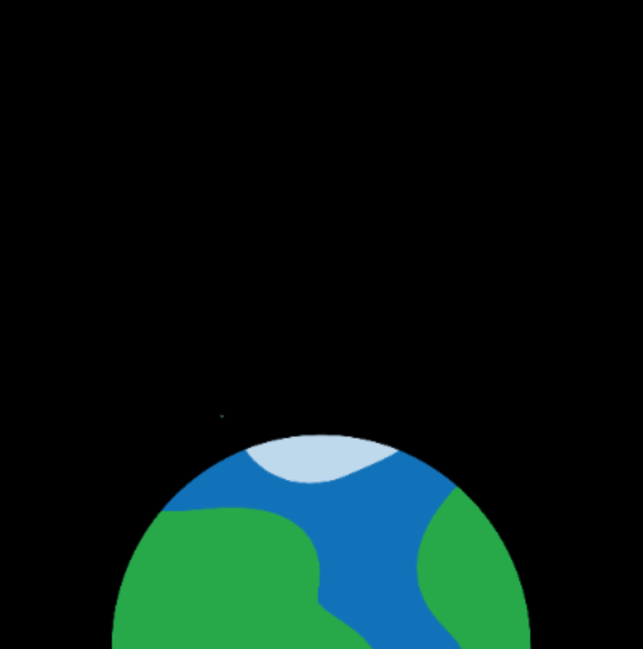

<h2 class="c-project-heading--task">Add a planet</h2>

--- task ---

➡️ Display an image of a planet.

--- /task --- 

The `image()` function needs the following:

+ image filename
+ x coordinate
+ y coordinate
+ image width
+ image height

--- task ---

Change the size and position of the planet by editing the numbers in the code.

--- /task ---

--- code ---
---
language: python
line_numbers: true
line_number_start: 12 
line_highlights: 15
---
def draw():
    # Make your animation here
    background(0, 0, 0)
    image(planet, width/2, 400, 300, 300)
--- /code ---

--- test ---

**Test:** Run your code and check that it draws a black background with half a planet at the bottom.

--- /test ---

{:width="300px"}

### Tip

The code `width` is the width of the screen and `width/2` will be half this, at the centre of the screen. 

