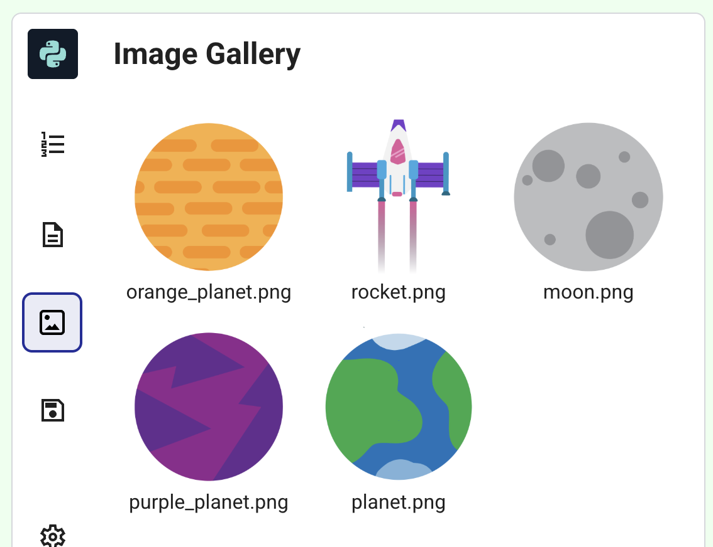

<h2 class="c-project-heading--task">A different planet?</h2>

--- task ---
➡️ Choose a different planet image.
--- /task --- 

--- task ---

Click on the image icon to view the image gallery. 

--- /task ---

--- task ---

Change the planet image in the code to the filename of your chosen planet, for example, `orange_planet.png`. 

--- /task ---

--- code ---
---
language: python
line_numbers: true
line_number_start: 6
line_highlights: 11
---
def setup():
    # Set up your animation here
    size(400, 400)
    image_mode(CENTER)
    global planet, rocket
    planet = load_image('orange_planet.png')
    rocket = load_image('rocket.png')
--- /code ---

--- task ---

**Test:** Run your code and find a planet that you want to use for your animation. 

--- /task ---

