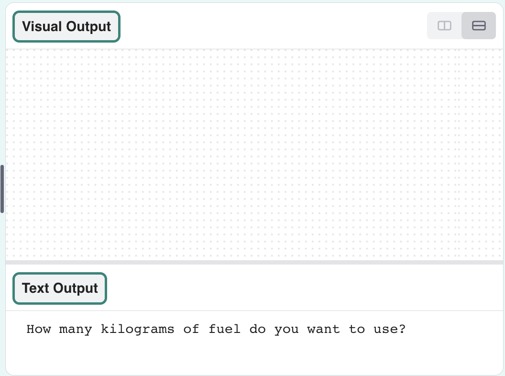
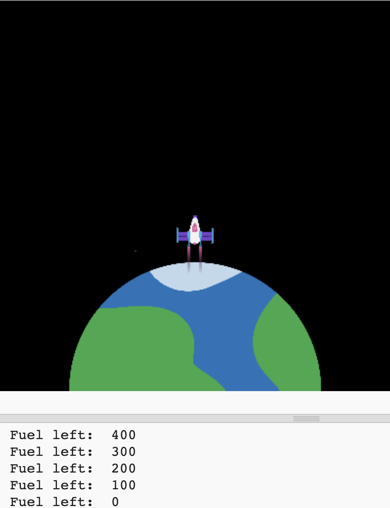

Each time a new frame is drawn, the rocket needs to move up the screen to create an animation effect.

{:width="300px"}

### Make the rocket fly

The `y` position of the rocket will start at 400 (the screen height) and then decrease by 1 each time a new frame is drawn.

--- task ---

--- /task ---

--- task ---

Define a `draw_rocket()` function to change the rocket's `y` position and redraw it.

`rocket_y -= 1` is a shorter way of saying `rocket_y = rocket_y - 1`.

--- code ---
---
language: python
filename: main.py
line_numbers: true
line_number_start: 11 
line_highlights: 12-16 
---

# The draw_rocket function goes here   
def draw_rocket():   
    global rocket_y  # Use the global rocket_y variable    
    rocket_y -= 1  # Move the rocket    
    image(rocket, width/2, rocket_y, 64, 64)    

--- /code ---

--- /task ---

--- task ---

Call your new `draw_rocket()` in the `draw()` function so that the rocket gets redrawn every frame.

--- code ---
---
language: python
filename: main.py
line_numbers: true
line_number_start: 33 
line_highlights: 36 
---

def draw():   
    # Things to do in every frame   
    draw_background()   
    draw_rocket()   

--- /code ---

--- /task ---

--- task ---  

**Test:** Run your code to check that the rocket starts at the bottom of the screen and moves up each frame.

--- /task ---

--- save ---

## Exhaust effects

The rocket will look more realistic with some special effects to simulate the exhaust trail. 

You can create cool effects by using a `for` loop to draw lots of shapes in each frame.

{:width="300px"}

Coding is used to make **graphic effects** for movies and games. It's much quicker to write code than to draw each frame of an animation individually. 

### Draw your exhaust

Drawing lots of yellow ellipses at different `y` positions creates an exhaust trail with a round bottom.
 
--- task ---

Update your `draw_rocket()` function to include a `for` loop that repeats the drawing of `25` exhaust ellipses. The **loop variable** `i` gets added to `rocket_y` to draw each ellipse further below the rocket. 

--- code ---
---
language: python
filename: main.py - draw_rocket()
line_numbers: true
line_number_start: 12
line_highlights: 16-20
---

def draw_rocket():
    global rocket_y   
    rocket_y -= 1   

    no_stroke()  # Turn off the stroke

    for i in range(25):  # Draw 25 burning exhaust ellipses   
        fill(255, 255, 0)  # Yellow   
        ellipse(width/2, rocket_y + i, 8, 3)  # i increases each time the loop repeats    

    image(rocket, width/2, rocket_y, 64, 64)

--- /code ---

--- /task ---

A `for` loop repeats a piece of code once for every item it is given. 

To run the code in a `for` loop a certain number of times, you can use the `range()` function. For example, `range(5)` creates a sequence of five numbers starting from 0, so [0, 1, 2, 3, 4].

Each time the `for` loop repeats, it sets a variable to the current item so that you can use it in the loop. 

--- task ---

**Test:** Run your code to check the rocket has a new exhaust trail.

{:width="300px"}

--- /task ---

### Add a gradient

The `i` variable can also be used to create a colour gradient with less green in each ellipse that gets drawn.

--- task ---

Change the call to `fill()` to set the amount of green to `255 - i * 10` so that the first ellipse has equal amounts of red and green and the last ellipse has very little green.

--- code ---
---
language: python
filename: main.py - draw_rocket()
line_numbers: true
line_number_start: 18
line_highlights: 19
---

    for i in range(25):   
        fill(255, 255 - i * 10, 0)  # Reduce the amount of green    
        ellipse(width/2, rocket_y + i, 8, 3)

--- /code ---
    
--- /task ---

--- task ---

**Test:** Check that you get a trail of ellipses gradually changing from yellow to red. 

--- /task ---

### Create a smoke effect

The smoke exhaust trail is created by drawing lots of slightly transparent grey ellipses at different positions in each frame. 

--- task ---

This time the `fill()` is outside the loop as the colour is the same for each smoke ellipse. The fourth input to `fill()` is the opacity, a low opacity value makes the colour more transparent so you can see the shapes underneath.

In each frame of the animation, 20 ellipses of random sizes will be drawn at random positions. 

--- code ---
---
language: python
filename: main.py - draw_rocket()
line_numbers: true
line_number_start: 18
line_highlights: 22-24
---

    for i in range(25):  
        fill(255, 255 - i * 10, 0)   
        ellipse(width/2, rocket_y + i, 8, 3)    

    fill(200, 200, 200, 100)  # Transparent grey   
    for i in range(20):  # Draw 20 random smoke ellipses    
        ellipse(width/2 + randint(-5, 5), rocket_y + randint(20, 50), randint(5, 10), randint(5, 10))    
    
    image(rocket, width/2, rocket_y, 64, 64)

--- /code ---

--- /task ---

--- task ---

**Test:** Run your program and check the exhaust fumes are visible. 

--- /task ---

--- save ---

## Burn fuel

One of the most important things to decide when launching a rocket is how much fuel to load into it. 

To do this, you need to simulate how much fuel will be burned on the journey.

{:width="300px"}

### Create a fuel variable

--- task ---

Add a variable to keep track of how much fuel your rocket burns (in frames).

--- code ---
---
language: python
filename: main.py
line_numbers: true
line_number_start: 7 
line_highlights: 10
---

# Setup global variables    
screen_size = 400   
rocket_y = screen_size  
burn = 100  # How much fuel is burned in each frame

--- /code ---

--- /task ---

--- task ---

At the bottom of your program, add code to ask the user how much fuel to add to the rocket and store their answer in a `fuel` global variable. 

--- code ---
---
language: python
filename: main.py 
line_numbers: true
line_number_start: 51
line_highlights: 51
---

fuel = int(input('How many kilograms of fuel do you want to use?'))   
run()
  
--- /code ---

--- /task ---

### Check fuel against burn

The rocket should only move if it hasn't burned all of its fuel.

--- task ---

Add code to the `draw_rocket()` function to reduce the remaining `fuel` by the `burn` of each frame. Use `print()` to show how much fuel is left in each frame.

You need to say that you want to use the global `fuel` and `burn` variables.

--- code ---
---
language: python
filename: main.py — draw_rocket()
line_numbers: true
line_number_start: 15 
line_highlights: 15, 17-18
---

    global rocket_y, fuel, burn   
    rocket_y -= 1   
    fuel -= burn  # Burn fuel   
    print('Fuel left: ', fuel)   

--- /code ---

--- /task ---

--- task ---

**Test:** Run your program to check that the animation doesn't start until `How many kilograms of fuel do you want to use?` has been answered. Try entering `30000` as the amount of fuel.

The rocket will keep going even if it has no fuel left. 

--- /task ---

--- task ---

The rocket should only move if it has enough fuel left. Add an `if` statement to check that `fuel >= burn`.

You will need to indent all of the lines of code before the `image()` function call. To do this, highlight all of the lines with the mouse and then tap the <kbd>Tab</kbd> on the keyboard to indent all the lines at once.

The `image()` line doesn't need to be indented because you always want to draw the rocket.

--- code ---
---
language: python
filename: main.py — draw_rocket()
line_numbers: true
line_number_start: 15
line_highlights: 17-30
---

    global rocket_y, fuel, burn  

    if fuel >= burn:  # Still got fuel   
        rocket_y -= 1   
        fuel -= burn   
        print('Fuel left: ', fuel)   
        
        no_stroke()  # Turn off the stroke   
        
        for i in range(25):   
            fill(255, 255 - i*10, 0)   
            ellipse(width/2, rocket_y + i, 8, 3)    
        
        fill(200, 200, 200, 100)   
        for i in range(20):   
            ellipse(width/2 + randint(-5, 5), rocket_y + randint(20, 50), randint(5, 10), randint(5, 10))   

    image(rocket, width/2, rocket_y, 64, 64)

--- /code ---

--- /task ---

--- task ---

**Test:** Run your program to check that the rocket stops when there is no fuel left. 

{:width="300px"}

--- /task ---

Did your rocket stop when it ran out of fuel? Well done, you sent a rocket to outer space!

--- save ---

## Reaching orbit

The point of launching the rocket is to propel a satellite into orbit. 

An orbit is a curved path that one object takes around another due to gravity.

The rocket can change colour to show how successful the launch was. 

{:width="400px"}

### Draw an orbit line

--- task ---

Create two new global variables to set the radius of the orbit circle and the `y` coordinate of the orbit to the point the rocket centre needs to reach to launch the satellite. 

--- code ---
---
language: python
filename: main.py
line_numbers: true
line_number_start: 7 
line_highlights: 11-12
---

# Setup global variables    
screen_size = 400   
rocket_y = screen_size   
burn = 100   
orbit_radius = 250   
orbit_y = screen_size - orbit_radius   

--- /code ---

--- /task ---

--- task ---

Update the `draw_background()` function to draw an ellipse to represent the satellite orbit that the rocket needs to reach.  

--- code ---
---
language: python
filename: main.py - draw_background()
line_numbers: true
line_number_start: 38
line_highlights: 42-45
---

def draw_background():   
    background(0)  # Short for background(0, 0, 0) — black   
    image(planet, width/2, height, 300, 300)   

    no_fill()  # Turn off any fill  
    stroke(255)  # Set a white stroke   
    stroke_weight(2)   
    ellipse(width/2, height, orbit_radius * 2, orbit_radius * 2)  

--- /code ---

--- /task ---

--- task ---

**Test:** Run your program and check that a white orbit line is drawn. 

{:width="300px"}

--- /task ---

### Launch the rocket to the orbit

The rocket should stop when it reaches the satellite orbit — the end of the mission. 

--- task ---

Update your `if fuel >= burn` code to also check that the rocket hasn't reached the orbit. 

You can use an `and` in `if` statements to check if two, or more, conditions are true. 

--- code ---
---
language: python
filename: main.py - draw_rocket()
line_numbers: true
line_number_start: 15
line_highlights: 19
---

# The draw_rocket function goes here   
def draw_rocket():   
    global rocket_y, fuel, burn
    
        if fuel >= burn and rocket_y > orbit_y:  # Still flying

--- /code ---

--- /task ---

--- task ---

**Test:** Run your project and enter `50000` as the amount of fuel. This should be plenty of fuel to reach orbit. The rocket should stop moving when it reaches orbit. 

--- /task ---

### Check if the launch is successful

The rocket should be coloured red if it runs out of fuel before getting high enough to launch the satellite.

--- task ---

--- code ---
---
language: python
filename: main.py — draw_rocket()
line_numbers: true
line_number_start: 30
line_highlights: 34-35
---

    fill(200, 200, 200, 100)   
    for i in range(20):   
        ellipse(width/2 + randint(-5, 5), rocket_y + randint(20, 50), randint(5, 10), randint(5, 10))

    if fuel < burn and rocket_y > orbit_y:  # No more fuel and not in orbit   
        tint(255, 0, 0)  # Failure

--- /code ---

--- /task ---

--- task ---

**Test:** Run your code and enter `20000` as the amount of fuel. Check that the rocket turns red when it stops below the orbit.

{:width="300px"}

Oh no, the planet has turned red! 

--- /task ---

--- task ---

The `tint()` function sets the tint colour for all images that are drawn until you change the tint or use `no_tint()` to turn it off.

**Choose:** Add a call to `no_tint()` after drawing the image so that the planet isn't tinted red in the next frame — or leave it if you like the planet turning red! 

--- code ---
---
language: python
filename: main.py - draw_rocket()
line_numbers: true
line_number_start: 34
line_highlights: 38
---

    if fuel < burn and rocket_y > orbit_y:    
        tint(255, 0, 0)  # Failure

    image(rocket, width/2, rocket_y, 64, 64)   
    no_tint()  # So the planet isn't tinted red in the next frame!
  

--- /code ---

--- /task ---

--- task ---

Use the `tint()` function again, this time to colour the rocket green if the rocket has enough fuel to reach the satellite orbit:  

--- code ---
---
language: python
filename: main.py - draw_rocket()
line_numbers: true
line_number_start: 34
line_highlights: 36-37
---

    if fuel < burn and rocket_y > orbit_y:    
        tint(255, 0, 0)  # Failure   
    elif rocket_y <= orbit_y:   
        tint(0, 255, 0)  # Success   

    image(rocket, width/2, rocket_y, 64, 64)   
    no_tint()
  
--- /code ---

--- /task ---

--- task ---

**Test:** Run your project and enter `50000` as the amount of fuel. Check that your rocket turns green when it reaches the satellite orbit.

{:width="300px"}

--- /task ---

You now have a simulation that can be used to show how much fuel is needed as a minimum to reach the satellite orbit. That's great; however, you could take a huge amount of fuel and still be successful, but this is costly and wasteful! 

--- task ---

Amend the conditions in your success code so that the rocket only turns green if it reaches the orbit `and` has less than 1,000kg of fuel left. 

Add code to colour the rocket yellow if the rocket has more than 1,000kg of fuel left when it reaches orbit. 

--- code ---
---
language: python
filename: main.py
line_numbers: true
line_number_start: 34
line_highlights: 36, 38-39
---

    if fuel < burn and rocket_y > orbit_y:   
        tint(255, 0, 0)  # Failure   
    elif fuel < 1000 and rocket_y <= orbit_y:   
        tint(0, 255, 0)  # Success   
    elif fuel >= 1000 and rocket_y <= orbit_y:    
        tint(255, 200, 0)  # Too much fuel   
    
    image(rocket, width/2, rocket_y, 64, 64)    
    no_tint()  # So the planet isn't tinted in the next frame!

--- /code ---

--- /task ---

--- task ---

**Test:** Run your program several times with different numbers; for example, 25,000kg of fuel should be the amount needed to turn the rocket green, but also check that the yellow tint works too by using a bigger number. 

{:width="300px"}

--- /task ---

--- save ---
