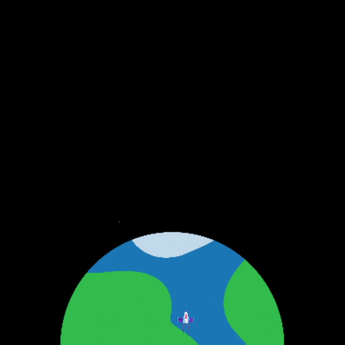

<h2 class="c-project-heading--task">Blast off!</h2>

--- task ---
Each time a new frame is drawn, the rocket needs to move up the screen to create an animation effect.

{:width="300px"}

The `rocket_position` of the rocket will start at 400 (the screen height) and then decrease by 1 each time a new frame is drawn.

--- /task --- 

--- code ---
---
language: python
line_numbers: true
line_number_start: 8 
line_highlights: 11
---

# The draw_rocket function goes here   
def draw_rocket():   
    global rocket_position     
    rocket_position = rocket_position - 1    
    image(rocket, width/2, rocket_position, 64, 64)    
--- /code ---

**Test:** Run your code to check that the rocket blasts off from the bottom of the screen.

