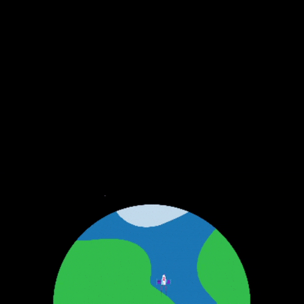

<h2 class="c-project-heading--task">Blast off!</h2>

--- task ---

Decrease the y coordinate `rocket_position` by 1 each time it is drawn to make an animation.

--- /task --- 

### Tip

You can make it move faster or slower by changing the decrease number.

--- code ---
---
language: python
line_numbers: true
line_number_start: 22
line_highlights: 23-24
---
    # Rocket
    global rocket_position
    rocket_position = rocket_position - 1   
    image(rocket, width/2, rocket_position, 64, 64)    
   
--- /code ---

--- task ---

**Test:** Run your code to check that the rocket blasts off from the bottom of the screen.

--- /task ---

{:width="300px"}

