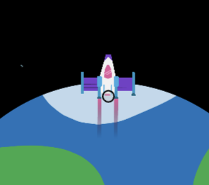

<h2 class="c-project-heading--task">Exhaust effects</h2>

--- task ---

Add some grey circles to simulate exhaust smoke. 

--- /task ---

--- task ---

+ Set the `fill` colour to transparent grey. 

+ Then draw a circle at the bottom of the rocket. Its size is generated by random number between 5 and 10.

--- /task ---

--- code ---
---
language: python
line_numbers: true
line_number_start: 10
line_highlights: 14
---
    # Rocket 
    rocket_position = rocket_position - 1    
    image(rocket, width/2, rocket_position, 64, 64)     
    fill(200, 200, 200, 100) 
    no_Stroke()
    ellipse(width/2, rocket_position, randint(5,10))

run()
--- /code ---

--- task ---

**Test:** Run your program and you should see small grey circles appear at the bottom of the rocket.

Change the numbers in `randint()` to see the random size circles get smaller or bigger.

--- /task ---

### Tip

+ `ellipse()` draws oval or circle shapes. Setting one value for the width and height draws a circle. 

+ `fill()` has 4 values: red, green, blue, and opacity. The opacity can be between 0 and 255, anywhere in between makes a transparent shape.

