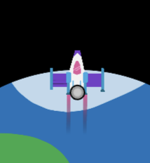

<h2 class="c-project-heading--task">Lots of circles</h2>

--- task ---

Add a loop to draw multiple circles, to make the exhaust effect even better.

--- /task ---

Add a loop which will run the code 20 times. Indent the `ellipse()` so that it is in the loop.

--- code ---
---
language: python
line_numbers: true
line_number_start: 23
line_highlights: 28-29
---
    # Rocket 
    rocket_position = rocket_position - 1    
    image(rocket, width/2, rocket_position, 64, 64)     
    stroke(0)
    fill(200, 200, 200, 100) 
    for i in range(20):
        ellipse(width/2, rocket_position, randint(5,10))    

--- /code ---

--- task ---

**Test:** Run your program. You will still see a flashing grey circle at the bottom of the rocket - all of the circles have been drawn on top of each other! 

--- /task ---

