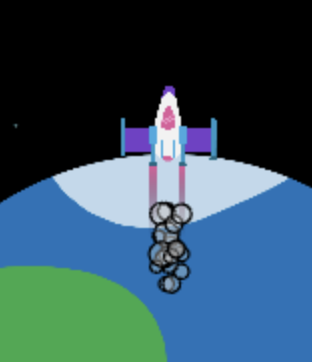

<h2 class="c-project-heading--task">Random circles</h2>

Generate the circles in random places instead of on top of each other.

<h2 class="c-project-heading--explainer">Follow these instructions</h2>

Change the `randint()` number ranges in your code to make your smoke how you want it.

--- code ---
---
language: python
line_numbers: true
line_number_start: 22
line_highlights: 28
---
    # Rocket
    global rocket_position
    rocket_position = rocket_position - 1   
    image(rocket, width/2, rocket_position, 64, 64)    
    fill(200, 200, 200, 100) 
    for i in range(20):
        ellipse(width/2 + randint(-5,5), rocket_position + randint(20,50), randint(5,10))

--- /code ---

## Now run your code

Run your program and you should see lots of grey circles in random places at the bottom of the rocket.

Confirm the observable result.
